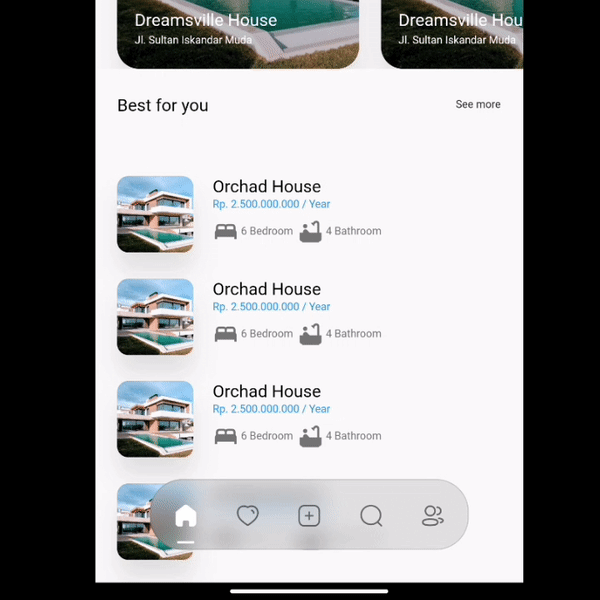
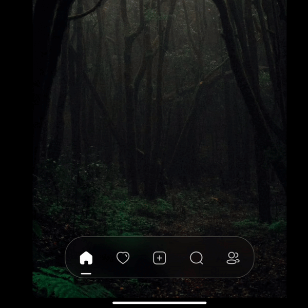

 <h1 align="center">  Crystal Bottom Navigation Bar</h1>

 <p align="center">

 
  <br>
  <a href="#" target="_blank"></a>
  <a href="#" target="_blank"></a>
  <br>
  <a href="#" target="_blank"></a>
  <a href="#" target="_blank"></a>
  <a href="#" target="_blank"></a>
  <a href="#" target="_blank"></a>
  <a href="#" target="_blank"></a>
  <br>
  <a href="#"></a>
  <a href="#" target="_blank"></a>


  <br>


</p>


A highly flexible bottom navigation bar that allows you to tailor it to your specific needs without any constraints. Elevate your UI/UX with seamless animations, customizable appearance—including the option to incorporate blur effects—and the ability to fully personalize the interface.




___

CRYSTAL BOTTOM NAVIGATION BAR
___ 
+ Blur navigation bar
+ Frosted navigation bar
+ Floating navigation bar
+ Rounded navigation bar
+ Modern navigation bar


## Getting Started

To install, add it to your `pubspec.yaml` file:

```
dependencies:
    crystal_navigation_bar:

```

```dart
import 'package:crystal_navigation_bar/crystal_navigation_bar.dart';
```

## How to use it

Use `CrystalNavigationBar` constructor in Your app with in Scaffold's `bottomNavigationBar:`

# Make sure extendBody in Scaffold should be true to use Floating behavior
          extendBody: true,
if you do not want to make round navigation bar with show body behind the navbar
you have to make that

          extendBody: false,

```dart
Widget build(BuildContext context) {
  return Scaffold(
    body: Center(),
    extendBody: true,//<------like this 
    bottomNavigationBar:  CrystalNavigationBar(
          currentIndex: _SelectedTab.values.indexOf(_selectedTab),
          onTap: _handleIndexChanged,
          indicatorColor: Colors.white,
          // enableFloatingNavBar: false
          items: [
            
            
          ],
        ),
  );
}
```

## basic implementation

```dart
Widget build(BuildContext context) {
    return Scaffold(
      extendBody: true,
      body: SizedBox(
        height: MediaQuery.of(context).size.height,
        child: Image.network(
          "https://images.pexels.com/photos/1671325/pexels-photo-1671325.jpeg?auto=compress&cs=tinysrgb&w=1260&h=750&dpr=2",
          fit: BoxFit.fitHeight,
        ),
      ),
      bottomNavigationBar: Padding(
        padding: const EdgeInsets.only(bottom: 10),
        child: CrystalNavigationBar(
          currentIndex: _SelectedTab.values.indexOf(_selectedTab),
          // indicatorColor: Colors.white,
          unselectedItemColor: Colors.white70,
          backgroundColor: Colors.black.withOpacity(0.1),
          // outlineBorderColor: Colors.black.withOpacity(0.1),
          onTap: _handleIndexChanged,
          items: [
            /// Home
            CrystalNavigationBarItem(
              icon: IconlyBold.home,
              unselectedIcon: IconlyLight.home,
              selectedColor: Colors.white,
            ),

            /// Favourite
            CrystalNavigationBarItem(
              icon: IconlyBold.heart,
              unselectedIcon: IconlyLight.heart,
              selectedColor: Colors.red,
            ),

            /// Add
            CrystalNavigationBarItem(
              icon: IconlyBold.plus,
              unselectedIcon: IconlyLight.plus,
              selectedColor: Colors.white,
            ),

            /// Search
            CrystalNavigationBarItem(
                icon: IconlyBold.search,
                unselectedIcon: IconlyLight.search,
                selectedColor: Colors.white),

            /// Profile
            CrystalNavigationBarItem(
              icon: IconlyBold.user_2,
              unselectedIcon: IconlyLight.user,
              selectedColor: Colors.white,
            ),
          ],
        ),
      ),
    );
  }

```

The constructor has 19 attributes related to the Widget:

- `items`: A list of tabs to display, example `Home`, `Profile`,`Search`, etc
- `currentIndex`: The tab to display.
- `onTap`:Returns the index of the tab that was tapped.
- `outlineBorderColor` : Border Color of the Bottom bar.
- `selectedItemColor`:The color of the icon and text when the item is selected.
- `unselectedItemColor`: The color of the icon and text when the item is not selected.
- `margin`:A convenience field for the margin surrounding the entire widget.
- `itemPadding`:The padding of each item.
- `duration`: The transition duration.
- `curve`: The transition curve.
- `indicatorColor`:The color of the tab indicator.
- `marginR`:margin for the bar to give some radius .
- `paddingR`:padding for the bar to give some radius.
- `borderRadius`:border radius for nav bar.
- `backgroundColor`:background colors for the nav bar.
- `boxShadow`: floating nav bar shadow ,it takes `List of BoxShadow`
- `enableFloatingNavBar`: make Floating nav bar enabled.
- `enablePaddingAnimation`: enable the animation on item during item change.
- `splashColor`: Color of the item's Splash Color. To disable, use `Colors.transparent`.


**iconly package is used for Icons in the demo/example**
## Adjust Colors of background, unselectedItemColor, selectedItemColor according to your UI for better Design.

#### Example Usage

See [Example Code](example/lib/main.dart) for more info.

### Contributing
Every pull request is welcome.

## Contributors
@its_immi

   

